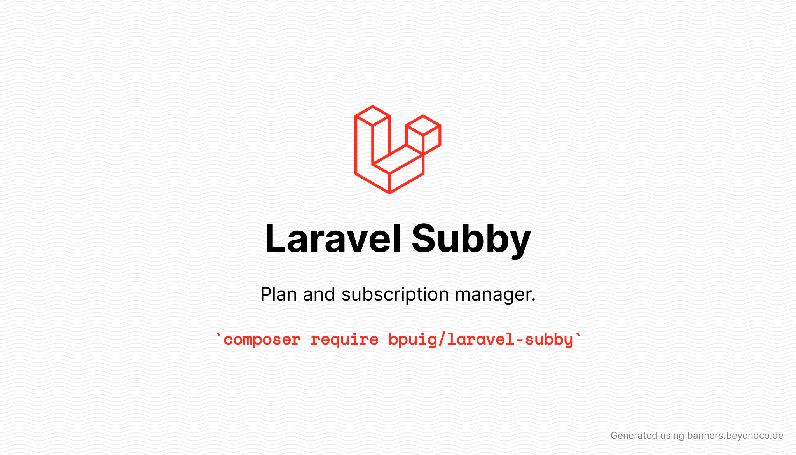

# Laravel Subby

**Laravel Subby** is a flexible plans and subscription management system for Laravel.
Originally forked from [rinvex/laravel-subscriptions](https://github.com/rinvex/laravel-subscriptions).
## Documentation

Read the docs in [https://bpuig.github.io/laravel-subby](https://bpuig.github.io/laravel-subby)

## Changelog

Refer to the [Changelog](https://bpuig.github.io/laravel-subby/CHANGELOG.md) for a full history of the project.

## License
Forked originally from [rinvex/laravel-subscriptions](https://github.com/rinvex/laravel-subscriptions). Thank you for creating the original!

This software is released under [The MIT License (MIT)](LICENSE).

(c) 2020 B. Puig, Some rights reserved.
